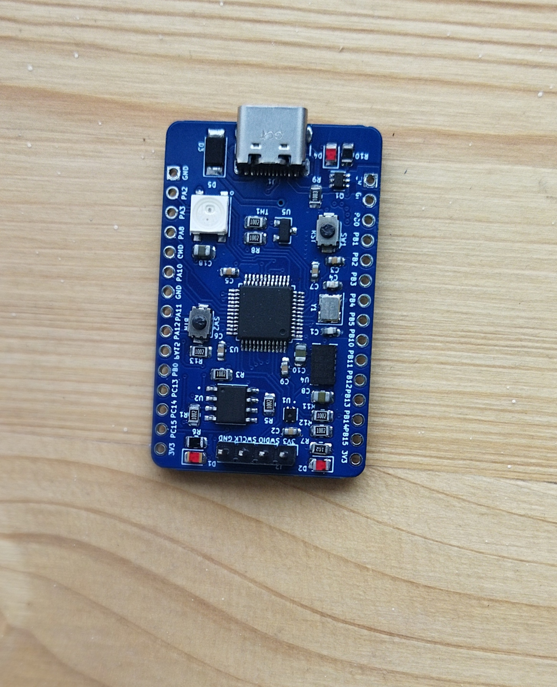
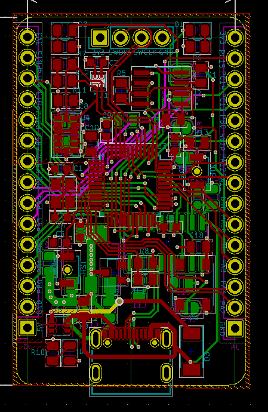
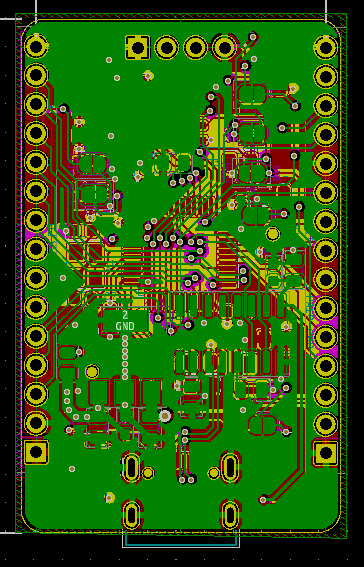

# STM32L151 board design with KiCad 
The design files are available and free to use . The Bill of materials is in Excel format and be ordered from Mouser website. For Any project related question do not hesitate to message me thanks.
## Manufactured board view

## Board Layout 3D View 

## Board Layout View 2

## Board Layout View 2

# List of sensors used in the design 
* Accelorometer 
* Analog Temperature sensor
* Digital Humidity and temperature sensor (I2C)
* External Flash memory (16Mbits)
* Digital RGB LED (IN-PI554FCH)
* Simple LED 