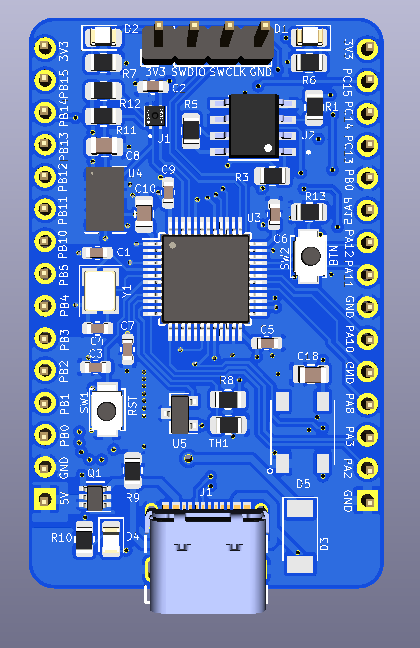

# STM32L151 board design with KiCad 

## Manufactured board view

## Board Layout 3D View 

## Board Layout View 2

## Board Layout View 2

# List of sensors used in the design 
* Accelorometer 
* Analog Temperature sensor
* Digital Humidity and temperature sensor (I2C)
* External Flash memory (16Mbits)
* Digital LED 
* Simple LED 